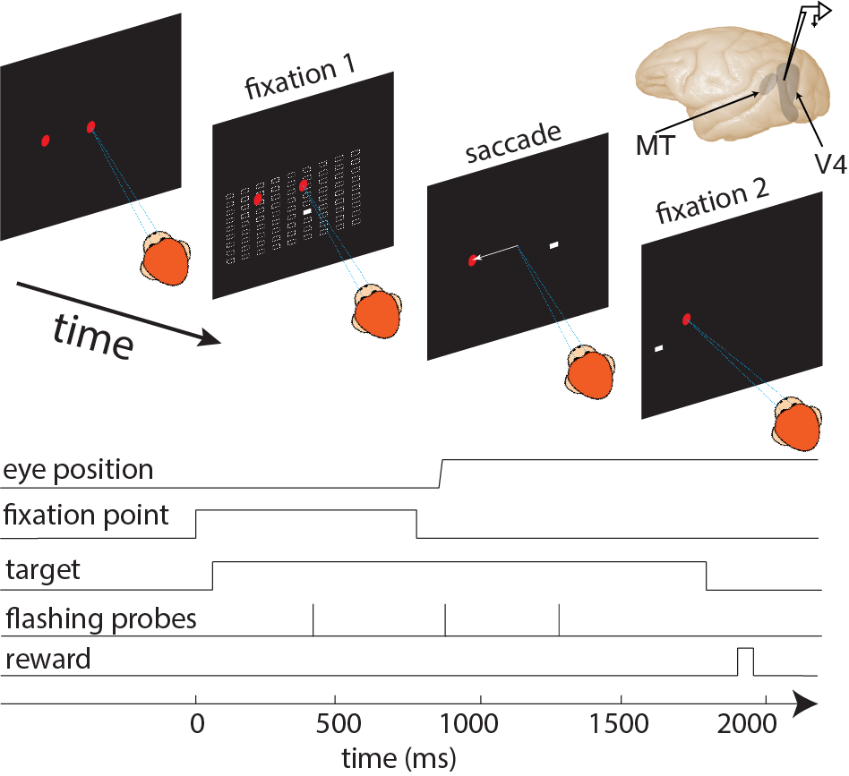
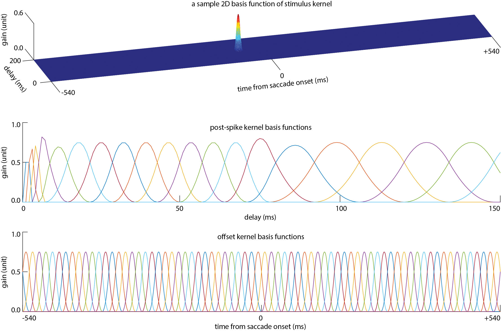
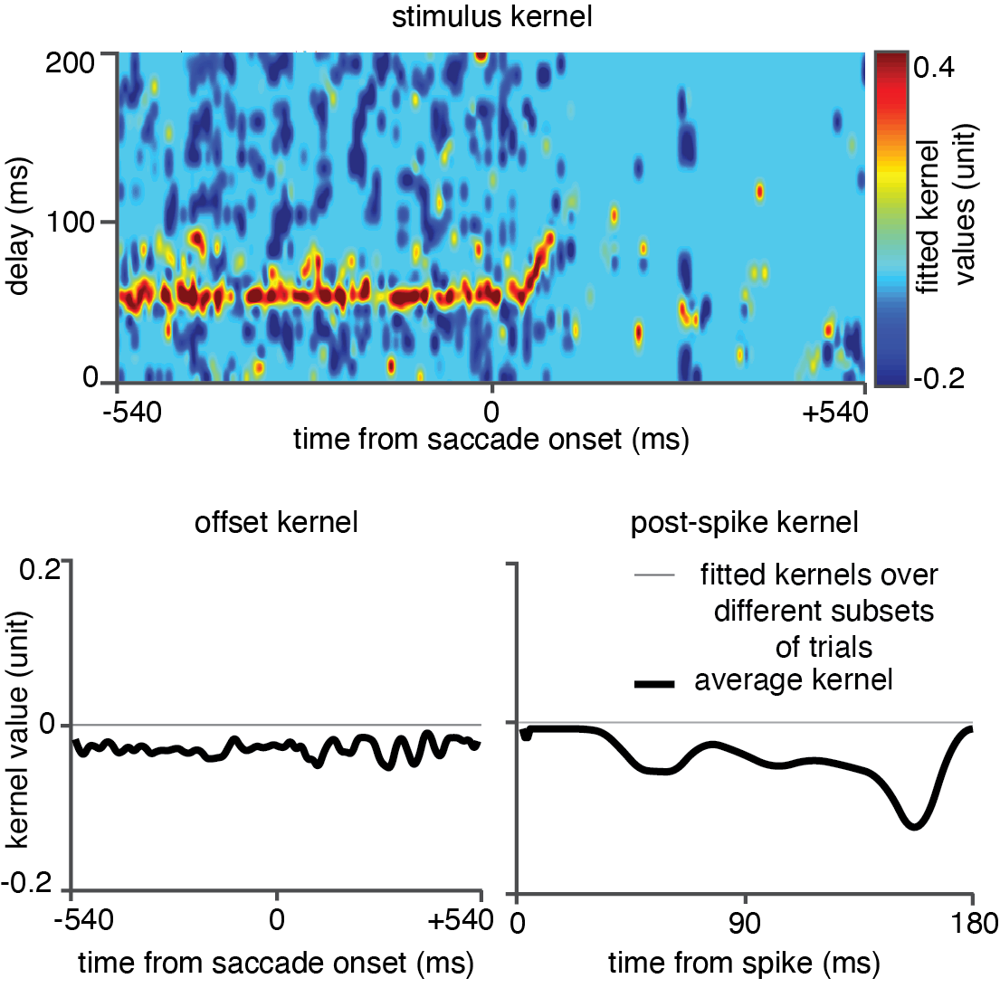
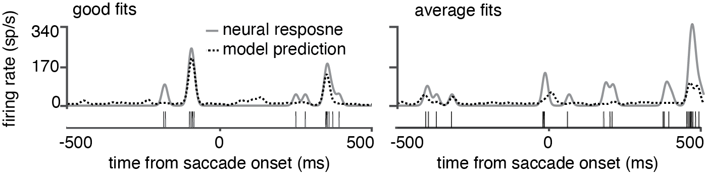

# Data flow
> All the following figures plotted for the neuron id `1505111501` and its receptive field proble location (probe index `52`).

## Experiment
### Paradigm

### Grid

### Stimulus

### Behavior

### Eye trace

## Stimuli and Responses

## Bases and Profile

## Kernels

## Predictions

