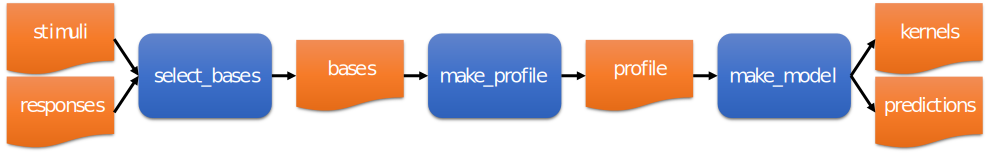
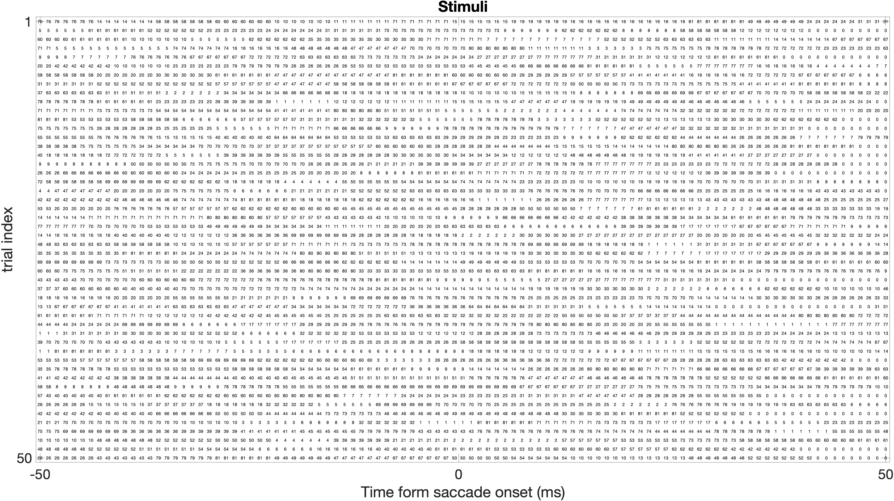
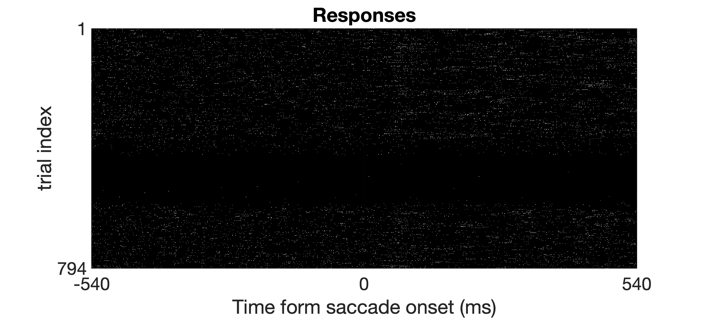
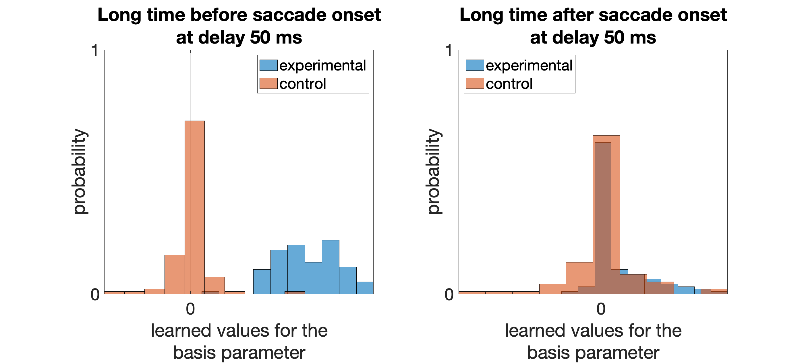
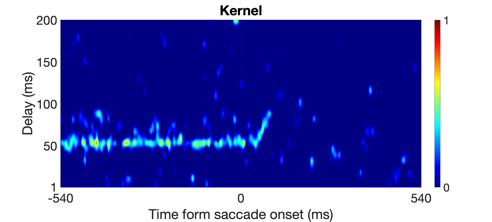
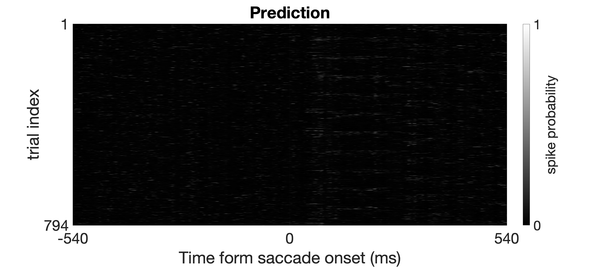

# Sparse Variable Generalized Linear Model (SVGLM)
> To see the previous version of this model, please click on this [link](https://github.com/nnategh/SFA-Models).

The sparse variable generalized linear model framework, termed the `SVGLM`, which is able to track the saccade-induced rapid changes occurring in the spatiotemporal sensitivity of the neurons on a millisecond timescale. The principal idea of the `SVGLM` is that the stimulus-response relationship in a neuron is characterized by a set of time-varying stimulus kernels, which represent the spatiotemporal receptive field of the neuron as varying along the time dimension. 

## Functional dependency
To execute the code, run the `main.m` script file. The call hierarchy/tree of main functions is shown in the following figure.

The following figure (you can zoom in for more details) shows the dependency network of the implemented functions (except plotting functions) in the project.

## Data flow
> All the following figures plotted for the neuron id `1505111501` and its receptive field proble location (probe index `52`). For more details see [1].

## References
[1] Niknam, K., Akbarian, A., Clark, K., Zamani, Y., Noudoost, B., & Nategh, N. (2019). Characterizing and dissociating multiple time-varying modulatory computations influencing neuronal activity. PLoS computational biology, 15(9), e1007275. [View Article](https://journals.plos.org/ploscompbiol/article?id=10.1371/journal.pcbi.1007275)
